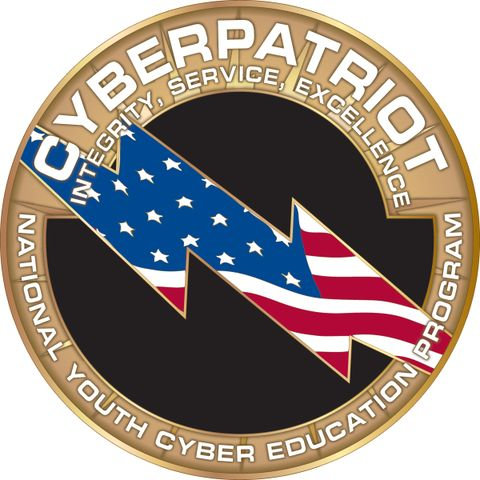

# Repo for CyberPATRIOT Tools


# Power Shell tricks #


## Check authorized users ##
Copy paste all the authorized usernames into C:\CyberPatriot\authorized.txt, including administrators. 

You can run command that will check and remove users that are on the system:
```PowerShell
 (Get-LocalUser).Name | ForEach-Object -Process {  if ( $_ -notin  (Get-Content -Path C:\CyberPatriot\authorized.txt)) {  Remove-LocalUser -Name $_ -Confirm } }

```
<details>
<summary>Alternartive code, with comments and variables:</summary>

```PowerShell
# Define the path to the text file containing your list of users
$userListFilePath = "C:\CyberPatriot\authorized.txt"

# Read the list of users from the text file into an array
$userList = Get-Content $userListFilePath

# Get a list of all user accounts on the system
$currentUsers = Get-LocalUser | Select-Object -ExpandProperty Name

# Loop through each user in the current user list
foreach ($currentUser in $currentUsers) {
    # Check if the current user is not in the list of users
    if ($userList -notcontains $currentUser) {
        # Remove the user account (you may want to add a confirmation prompt or additional safety checks)
        Remove-LocalUser -Name $currentUser -Force
    }
}

# Display a message indicating the process is complete
Write-Host "User removal process complete."
```
</details>

<b>Explanation for the command:</b>


```(Get-LocalUser).Name``` lists all the current users on the system:
```
Administrator
ashat
DefaultAccount
Guest
WDAGUtilityAccount
```
```(Get-Content -Path C:\CyberPatriot\authorized.txt)``` lists all the names copy pasted from Cyberpatriot instructions

```PowerShell
(Get-LocalUser).Name | ForEach-Object -Process {   $_  }
``` 
iterates over each local user on the system and executes code in ```-Process``` block in ```{ }``` with ```$_``` variable for username of the local user

Now we check if the local users are in our authorized list file, with operator ```-notin```:
```PowerShell
 (Get-LocalUser).Name | ForEach-Object -Process {  $_ -notin  (Get-Content -Path C:\CyberPatriot\authorized.txt)  }

```
Putting it all together with ```if``` users not in our authorized file list, we run PowerShell remove users command: ```Remove-LocalUser -Name $_ -Confirm```

First we want to display which users we will remove:
```PowerShell
 (Get-LocalUser).Name | ForEach-Object -Process {  if ( $_ -notin  (Get-Content -Path C:\CyberPatriot\authorized.txt)) {   $_  } }
 ```

Then we execute actual ```Remove-LocalUser```

```PowerShell
 (Get-LocalUser).Name | ForEach-Object -Process {  if ( $_ -notin  (Get-Content -Path C:\CyberPatriot\authorized.txt)) {  Remove-LocalUser -Name $_ -Confirm } }
```

[Python scan tool](PYTHON_TOOL.MD)


